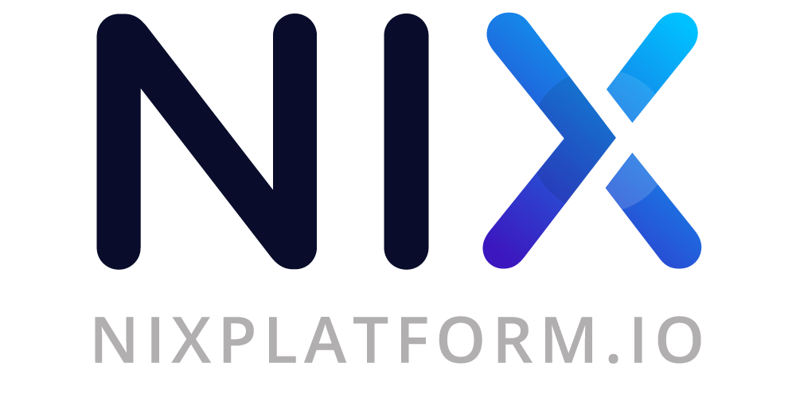

    

### What is LIBERCOIN?
---

LIBERCOIN is a digital currency that combines Atomic Swaps/Smart Contracts and privacy using our unique, innovative Ghost Protocol to provide the world with a truly anonymous and decentralized transfer of assets for the cross-chain era

### Key Features
---

* LIBERCOIN utilizes a custom built privacy library that integrates Zerocoin/Stealthoutputs/Bulletproofs and TOR support. This allows transaction privacy in its fullest and most trustless form.

* LIBERCOIN aims to create a privatized DEX platform built on top of already developed DEX volumes to conduct privatized atomic swaps through use of LIBERCOIN’s privacy library.

* Ghost Protocol and Ghost Vault to enhance privacy features.

For more information, please visit [liberco.in](https://liberco.in/liberco.in) or read the [whitepaper](https://liberco.in/docs/LIBERCOIN-Platform-Whitepaper.pdf).

### Guides & Documentation

* [White Paper](https://liberco.in/docs/LIBERCOIN-Platform-Whitepaper.pdf)
* [LIBERCOIN Ghost Nodes](https://libercoinplatform.zendesk.com/hc/en-us/articles/360005044571-Setting-up-your-Ghost-Node)

### Links & Resources
---

* [LIBERCOIN Website](https://liberco.in)
* [Discord Chat](https://chat.liberco.in/)
* [Reddit](https://reddit.com/r/libercoinplatform)
* [Medium](https://medium.com/@libercoinplatform)
* [Twitter](https://twitter.com/libercoinplatform)
* [GitHub wiki](https://github.com/libercoinplatform/libercoincore/wiki)

License
---

LIBERCOIN Core is released under the terms of the MIT license. See [COPYING](COPYING) for more
information or see https://opensource.org/licenses/MIT.

Copyright (c) 2017-2018 The LIBERCOIN Core Developers Copyright (c) 2013-2015 The Bitcoin Core Developers
